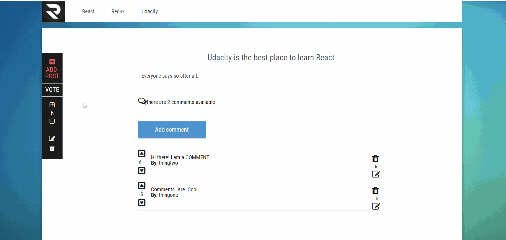

## Readable

Demo : https://isholaomotayo.github.io/readable/

The Readable Project is a dynamic post management application built on React and Redux

The Readable app makes use of a Node JS backend which can be download from [https://github.com/udacity/reactnd-project-readable-starter](here)

### Before you run the Readable project please ensure you d the following:
1. install node.js from [ https://nodejs.org ](here) . Make sure that you install node with the PATH variable so you can run node anywhere in your command prompt/terminal
1. Download  the readable server from [https://github.com/udacity/reactnd-project-readable-starter](https://github.com/udacity/reactnd-project-readable-starter)
1. Install the requirements from the included package.json file: npm install
1. Run the server with `node server`
1. Clone the readable project repository
1. navigate to the project repository with `cd reactReadable`
1. Install the requirements from the included package.json file: `npm install`
1. start the app with `npm start`

# By Omotayo Ishola
